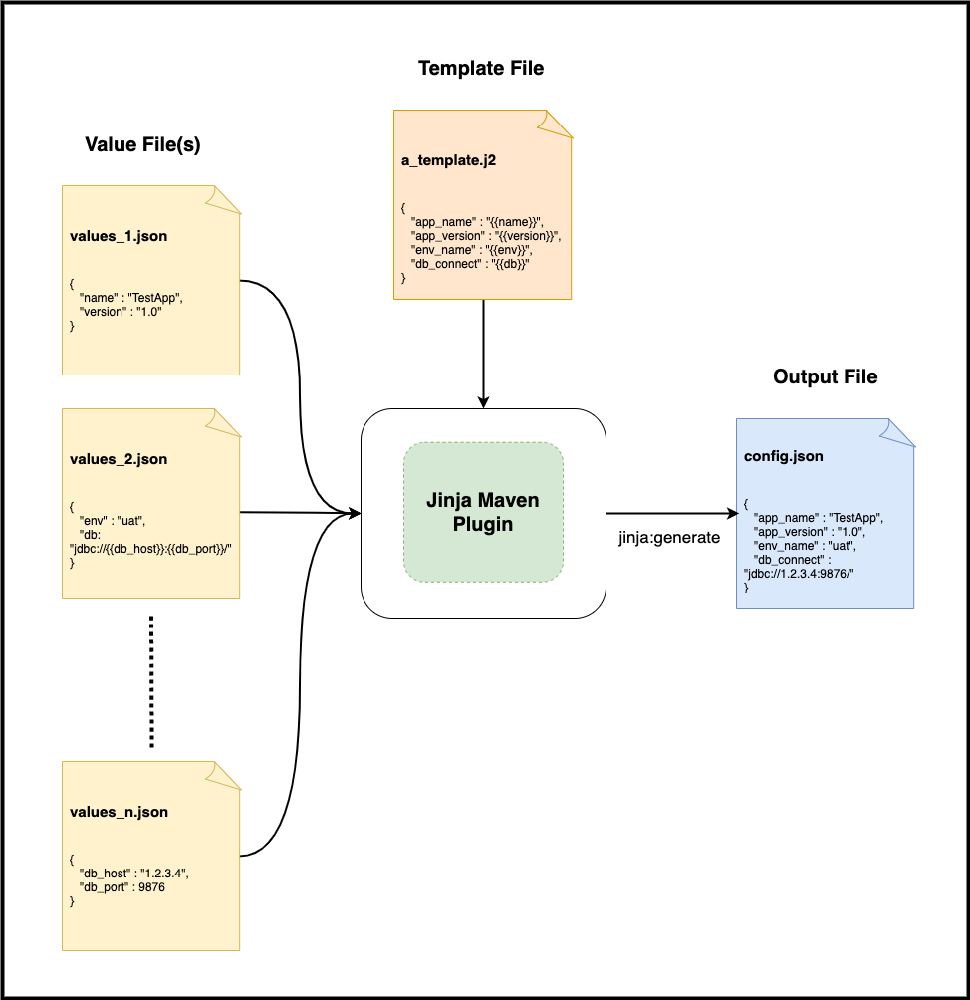

jinja-maven-plugin
====================
[Apache Maven](http://maven.apache.org) plugin to automatically render concrete
resources using [Jinja](https://jinja.palletsprojects.com/en/2.11.x/)
templating engine during project build time. For more details visit the
[project webpage](https://chitralverma.github.io/jinja-maven-plugin/).



This plugin uses jinjava,
see [this link](https://github.com/HubSpot/jinjava#jinjava) for more info.

## Requirements

This project has the following requirements,

- JDK 8
- Maven 3.3 and above

## Quick Links

- [Installation and Usage](https://chitralverma.github.io/jinja-maven-plugin/usage.html)
- [Configuration](https://chitralverma.github.io/jinja-maven-plugin/configuration.html)
- [Examples](https://chitralverma.github.io/jinja-maven-plugin/examples.html)
- [Goal Details](https://chitralverma.github.io/jinja-maven-plugin/generate-mojo.html)
- [Javadoc](https://chitralverma.github.io/jinja-maven-plugin/apidocs/index.html)

## Build from Source

To build this project from source, run the commands below,

```
# Clone project to current working directory
git clone https://github.com/chitralverma/jinja-maven-plugin.git
```

```
# Change directory to cloned project root 
cd jinja-maven-plugin
```

```
# Build project 
mvn clean install
```

_**Note:** Maven 3.3+ and Git are required to build project from source._

## Upcoming Features

* Dry Run
* Wildcard support for value file paths

## Contributing

I'm interested in building a community and would welcome any thoughts/
suggestions/ patches. You can reach me [here](mailto:chitralverma@gmail.com).

## License

Copyright © 2021 Chitral Verma

Licensed under the
[Apache License, Version 2.0](http://www.apache.org/licenses/LICENSE-2.0)